<p align="center">
  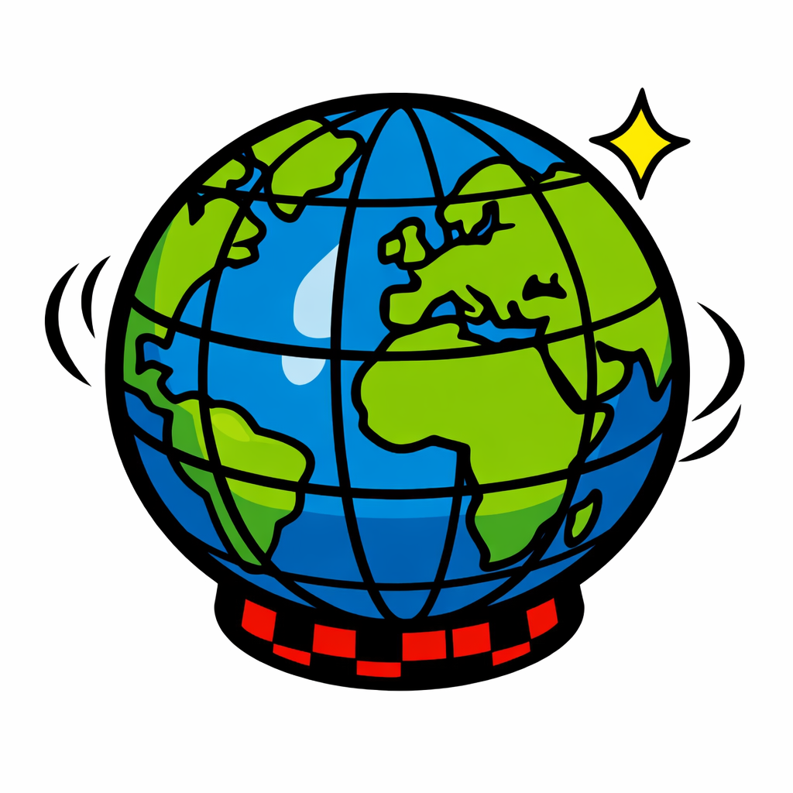
</p>

<h1 align="center">Globi</h1>

<p align="center">
  <strong>Interactive 3D globe visualization for the web</strong><br>
  Lightweight, embeddable, and built for creators, educators, and newsrooms.
</p>

<p align="center">
  <a href="#quick-start">Quick Start</a> &middot;
  <a href="#examples">Examples</a> &middot;
  <a href="#features">Features</a> &middot;
  <a href="docs/QUICK_START_EMBED.md">Embedding Guide</a> &middot;
  <a href="docs/QUICK_START_CONTENT_CREATORS.md">Content Creator Guide</a> &middot;
  <a href="LICENSE">MIT License</a>
</p>

---

Globi is a browser-native `<globi-viewer>` web component that renders interactive 3D globes and flat-map projections using WebGL. It was built to help **content creators, website editors, newspapers, and educators** visualize geographical and geopolitical information more interactively — and more accurately — than static images or 2D maps allow.

Drop a single HTML tag into any page, feed it a JSON scene, and you get a fully interactive globe with markers, paths, arcs, regions, real-time data, and animations.

**What's included:** 13 celestial bodies with NASA textures, 5 visual themes, 3 flat-map projections, a keyframe animation engine, GeoJSON/OBJ/USDZ export, full keyboard and screen-reader accessibility, dynamic data-source attribution, an AI agent API, and a WYSIWYG scene editor — all in a single `<globi-viewer>` tag with zero configuration required.

## Quick Start

### Via CDN

```html
<script type="module" src="https://unpkg.com/globi-viewer/dist/globi.min.js"></script>

<globi-viewer style="width: 100%; height: 500px;"></globi-viewer>

<script>
  document.querySelector('globi-viewer').loadScene({
    planet: { id: 'earth' },
    markers: [
      { id: 'zurich', name: 'Zurich', lat: 47.37, lon: 8.54, visualType: 'dot' },
      { id: 'tokyo', name: 'Tokyo', lat: 35.68, lon: 139.69, visualType: 'dot' },
    ],
    arcs: [
      { id: 'zrh-tyo', start: { lat: 47.37, lon: 8.54 }, end: { lat: 35.68, lon: 139.69 }, color: '#ffd000' },
    ],
  });
</script>
```

### From Source

```bash
git clone https://github.com/salam/globi.git
cd globi
npm install
npm run serve:editor    # opens editor at http://localhost:4173/editor/
```

### Build for Production

```bash
npm run build           # outputs dist/globi.min.js (~single bundled file)
```

## Examples

Globi ships with ready-to-use example scenes. Each one is a standalone HTML page you can open directly or embed in an iframe.

### Earth

| Preview | Example | Showcased Features |
| ------- | ------- | ------------------ |
| 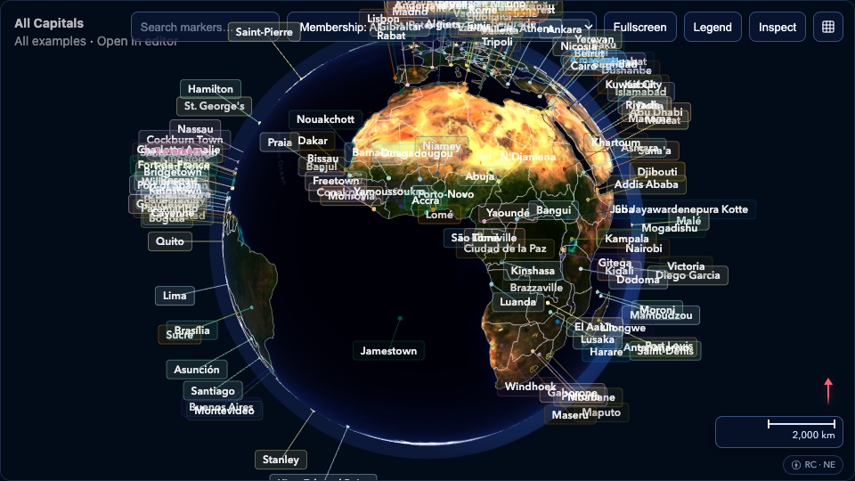 | [**All World Capitals**](https://globi.world/examples/all-capitals.html)<br>190+ capital cities with UN/NATO membership filters | Markers, callout clustering, category filters, legend grouping, fly-to |
| 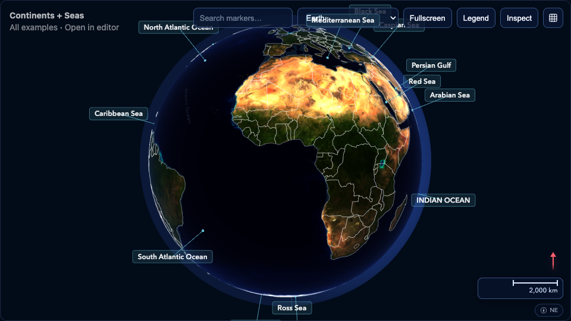 | [**Continents & Seas**](https://globi.world/examples/continents-and-seas.html)<br>Continental and ocean boundaries from Natural Earth | Regions, geo labels, borders, data attribution |
| 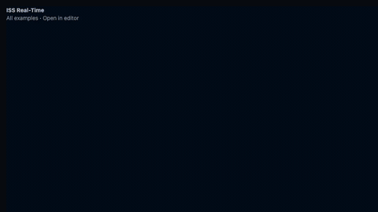 | [**ISS Real-Time**](https://globi.world/examples/iss-realtime.html)<br>Live International Space Station position and orbital path | Real-time data, loading state, pulsating animation, 3D model marker, paths |
|  | [**Naval Vessels (OSINT)**](https://globi.world/examples/naval-vessels.html)<br>Carrier strike groups from open-source intelligence | Nation filters, time range filter, trail paths, data attribution |
| 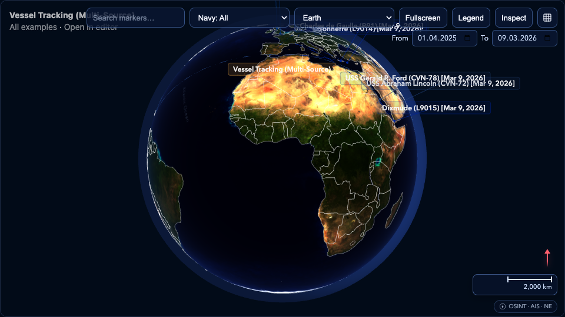 | [**Vessel Tracking (Multi-Source)**](https://globi.world/examples/vessel-tracking.html)<br>21 naval vessels from 5 nations with AIS integration | Multi-source data pipeline, nation filters, dashed trail paths |
| 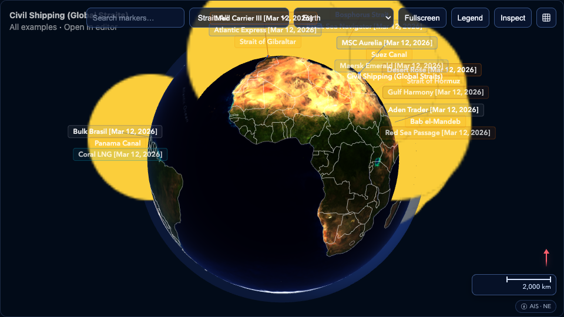 | [**Civil Shipping**](https://globi.world/examples/civil-shipping.html)<br>Vessel traffic across 9 major shipping straits | Strait filters, category grouping, data attribution |
| 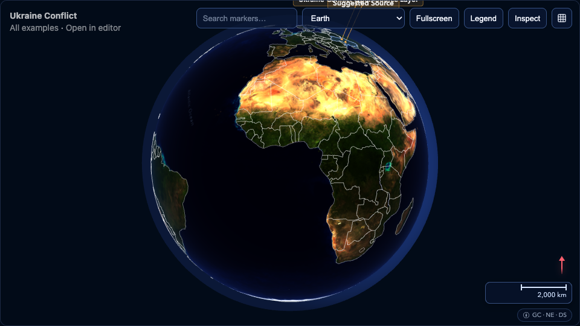 | [**Ukraine Conflict**](https://globi.world/examples/ukraine-conflict.html)<br>Open-source conflict context layer | Regions, GeoJSON import, data attribution |
| 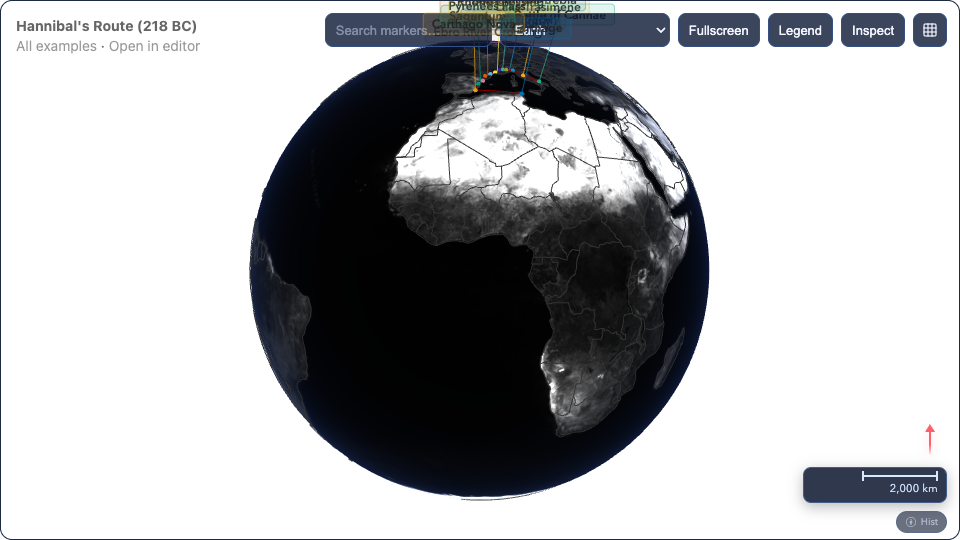 | [**Hannibal's Route (218 BC)**](https://globi.world/examples/hannibal-route.html)<br>Campaign march from Carthage to Cannae with 13 waypoints | Paths, grayscale-shaded theme, historical data, callouts |
| 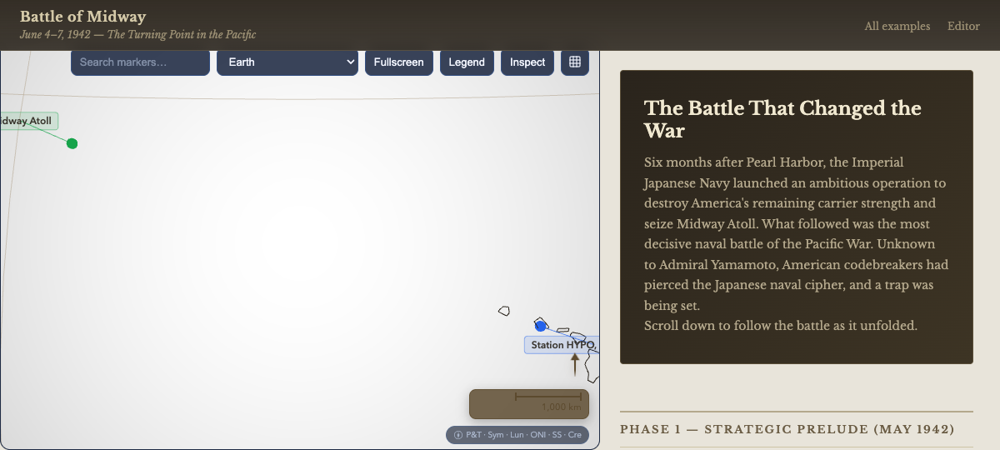 | [**Battle of Midway (1942)**](https://globi.world/examples/battle-of-midway.html)<br>25-step scrollytelling of the Pacific naval battle | Scrollytelling, external widget control, animated arcs, source citations |
| 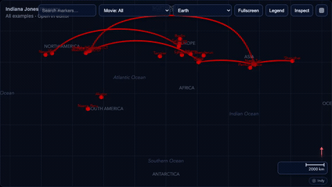 | [**Indiana Jones Itinerary**](https://globi.world/examples/indiana-jones.html)<br>Flight routes from all 5 films with animated red arcs | Animated arcs, per-movie filters, equirectangular flat map |

### Beyond Earth

| Preview | Example | Showcased Features |
| ------- | ------- | ------------------ |
| 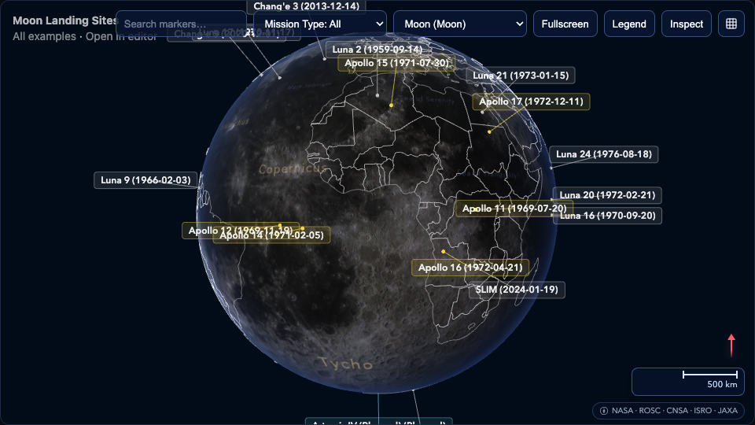 | [**Moon Landing Sites**](https://globi.world/examples/moon-landings.html)<br>Every lunar landing — Apollo, Luna, Chang'e, and future Artemis sites | Celestial body switching, body-specific labels, callouts |
| 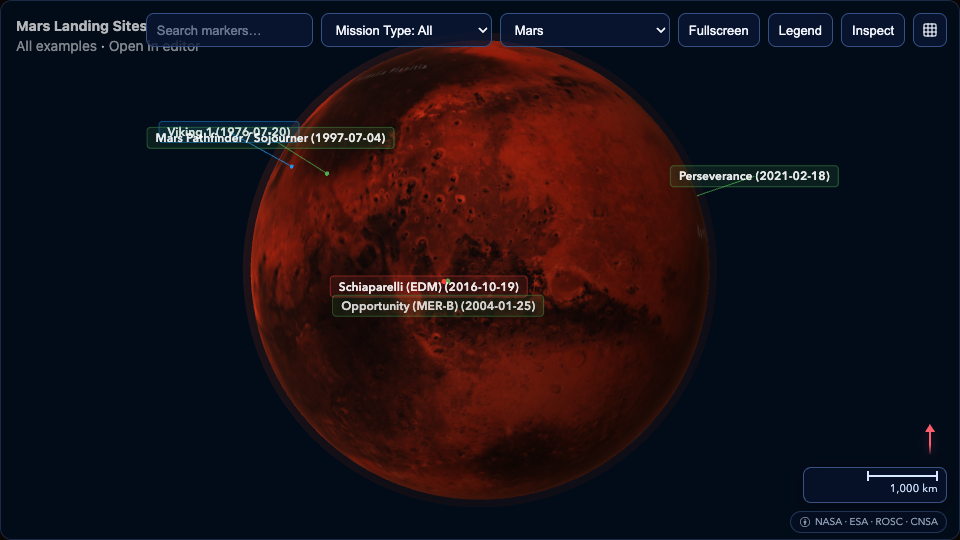 | [**Mars Landing Sites**](https://globi.world/examples/mars-landings.html)<br>Viking to Perseverance — all Mars landers and rovers | Mars textures, landmark labels (Olympus Mons), atmosphere rendering |
| 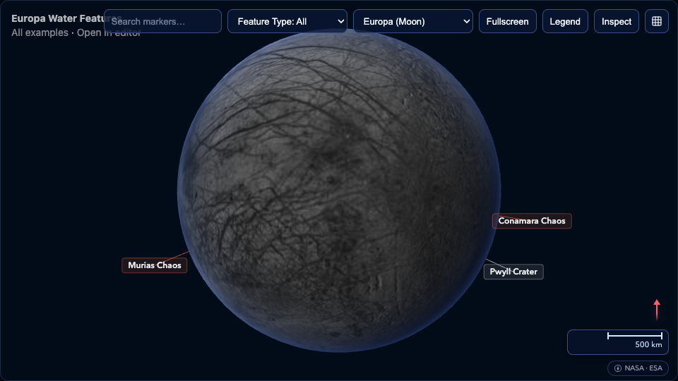 | [**Europa: Subsurface Water**](https://globi.world/examples/europa-water.html)<br>Suspected ocean features on Jupiter's icy moon | Progressive texture loading, region overlays on ice moon |
| 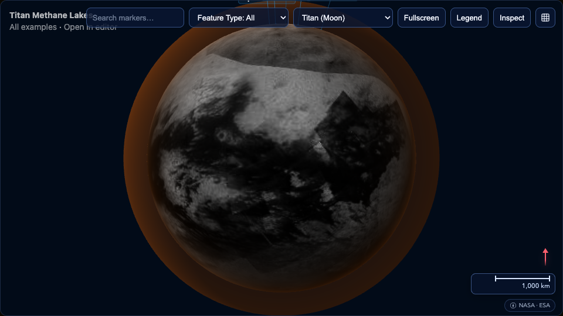 | [**Titan: Methane Lakes**](https://globi.world/examples/titan-lakes.html)<br>Kraken Mare, Ligeia Mare, and other hydrocarbon seas | Thick atmosphere rendering, region overlays, body-specific labels |

### Theme Variants

| Preview | Example | Showcased Features |
| ------- | ------- | ------------------ |
| 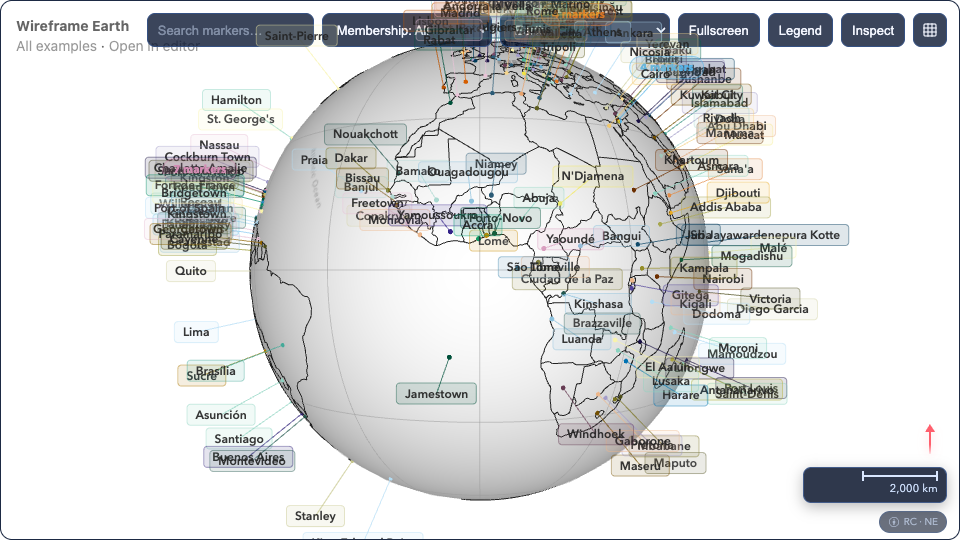 | [**Wireframe Globe**](https://globi.world/examples/wireframe.html)<br>Clean black-and-white wireframe rendering | Wireframe-shaded theme, graticule grid, borders |
| 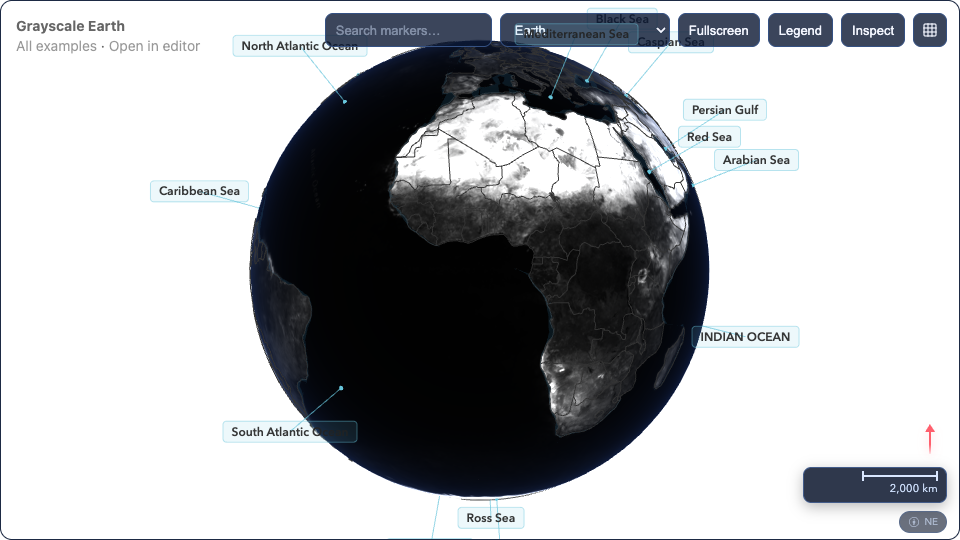 | [**Grayscale Globe**](https://globi.world/examples/grayscale.html)<br>Desaturated flat-lit cartographic style | Grayscale-flat theme, even lighting, cartographic style |

> Browse all examples at [globi.world/examples](https://globi.world/examples/).

### Embedding an Example

```html
<iframe
  src="https://globi.world/examples/moon-landings.html"
  width="100%" height="600"
  style="border: none; border-radius: 8px;"
  allow="fullscreen"
></iframe>
```

## Features

### 13 Celestial Bodies
Mercury, Venus, Earth, Mars, Jupiter, Saturn, Uranus, Neptune — plus the Moon, Io, Europa, Ganymede, and Titan. Each with NASA/ESA surface textures, accurate axial tilt, and atmospheric rendering.

### 5 Visual Themes
- **Photo Realistic** — Textured globe with atmosphere and city lights
- **Wireframe Shaded** — Clean line art with depth shading
- **Wireframe Flat** — Flat wireframe, ideal for print
- **Grayscale Shaded** — Desaturated textures with lighting
- **Grayscale Flat** — Desaturated, even lighting for cartographic use

### Scene Data Model
Everything is driven by a simple JSON format:

```json
{
  "planet": { "id": "earth" },
  "theme": "photo",
  "markers": [{ "id": "m1", "name": "Zurich", "lat": 47.37, "lon": 8.54 }],
  "paths": [],
  "arcs": [],
  "regions": [],
  "animations": [],
  "filters": [],
  "dataSources": []
}
```

### Interactive Features
- Mouse, touch, and keyboard navigation
- Marker callouts with hover/click/always modes
- Legend panel with category filtering
- Full-text search with fly-to
- Fullscreen mode
- Flat-map projection toggle (Azimuthal, Orthographic, Equirectangular)
- Compass HUD and kilometer scale bar
- Data source attribution panel

### Import & Export
- JSON scene import/export
- GeoJSON import/export
- OBJ mesh export
- USDZ export (placeholder)

### WYSIWYG Editor
An included editor at `editor/index.html` lets you build scenes visually — add markers, paths, arcs, and regions with live preview. Includes geocoding via OpenStreetMap Nominatim.

### Internationalization
Built-in support for English, German, French, and Italian. Marker names and descriptions can be localized per-locale.

## Feature Reference

| Category | Feature | Description |
| ---------- | ------- | ------------- |
| **Rendering** | 3D Globe | WebGL-powered Three.js renderer with 60 FPS, day/night textures, city lights, and Fresnel atmosphere glow |
| | Flat Map Projections | Three 2D projection modes — Azimuthal Equidistant, Orthographic, Equirectangular — with full feature parity |
| | Celestial Bodies | 13 planets and moons with NASA/ESA textures, axial tilt, ring systems, and progressive 2K→8K resolution |
| | Visual Themes | 5 themes (Photo Realistic, Wireframe Shaded/Flat, Grayscale Shaded/Flat) with automatic border and graticule styling |
| **Data Layers** | Markers | Dot, image (billboard), model, and text visual types with auto-assigned color-blind-safe palette |
| | Arcs | Great-circle arcs with configurable altitude, color, width, and dash animation |
| | Paths | Multi-point polylines with stroke width, color, and dash patterns |
| | Regions | GeoJSON polygon/multipolygon overlays with fill color and extrusion |
| | Callouts | Spatially anchored labels with leader lines, per-marker color, and mode (always/hover/click/none) |
| | Callout Clustering | Nearby markers auto-stack (2–3) or collapse into expandable group badges (4+); zoom-aware |
| | Filters | Scene-defined filter groups (category, time range) with viewer dropdown; markers hide/show by category |
| **Interaction** | Navigation | Mouse drag, scroll-zoom, touch pinch/rotate, and full keyboard control |
| | Surface-Grab Drag | Grab point tracks cursor like a physical ball; sensitivity scales with zoom level |
| | Fly-To | Click a legend entry or search result to animate the camera to any marker |
| | Fulltext Search | Type to filter markers by name, description, or ID; single match flies to marker |
| | Fullscreen | One-click fullscreen toggle with ESC listener |
| | Context Menu | Right-click / long-press / Shift+F10 opens entity-specific actions (export, copy coordinates, fly-to, inspect) |
| | Legend | Filterable marker list grouped by category with colored symbols and click-to-focus |
| | Compass & Scale Bar | North-oriented compass arrow with 3D tilt foreshortening; dynamic kilometer scale bar |
| **Accessibility** | Keyboard Navigation | Full keyboard-first interaction — Tab through markers, Enter to inspect, arrow keys to rotate |
| | Screen Reader | Natural-language view descriptions announced via `aria-live` (brief ~50 words, detailed ~150 words) |
| | Callout Text | Real HTML rendered via CSS2DRenderer — selectable, copy-pastable, and screen-reader accessible |
| | Color-Blind Safe | Auto-assigned 10-color palette designed for color vision deficiency; shade variants beyond 10 markers |
| **Data Attribution** | Source Metadata | Scene-level `dataSources[]` with name, URL, license, and description per source |
| | Per-Entity Linking | Every marker, arc, path, and region can reference its `sourceId` |
| | Attribution Label | Abbreviated bottom-right label showing sources of visible entities; updates dynamically on pan/zoom |
| | Attribution Panel | Slide-in panel with full source details, clickable URLs, and three-section grouping (visible / off-screen / unused) |
| **Export & Import** | JSON | Full scene round-trip — export and re-import the complete scene graph |
| | GeoJSON | Import GeoJSON features into markers/paths/regions; export scene entities as GeoJSON |
| | OBJ | Export the 3D globe mesh as Wavefront OBJ |
| | USDZ | Export contract for Apple AR Quick Look (placeholder) |
| **Customization** | Themes | 5 built-in visual themes switchable at runtime; legacy dark/light values auto-map to photo |
| | Viewer UI Toggles | Show or hide individual controls (legend, search, compass, scale bar, fullscreen, projection toggle, attribution) |
| | Button Labels | Switch toolbar buttons between icon-only and text labels |
| | Idle Rotation | Automatic slow spin following each body's real rotation direction and speed |
| | Loading State | `loading` attribute triggers fast spin + pulsing indicator; restores previous speed on completion |
| | Projection Attribute | Set `projection` as an HTML attribute or via `scene.projection` in JSON for programmatic control |
| **AI & Automation** | Agent API | `window.globi` exposes 28 commands — read state, navigate, mutate entities, export, switch themes |
| | DOM Attributes | `data-globi-*` attributes on `<globi-viewer>` for agent discoverability (body, projection, zoom, marker count) |
| | LLMs.txt | Structured plain-text view-state snapshot for AI consumption (visible entities, filters, available actions) |
| | Multi-Instance | `window.globiAll` tracks all viewer instances; ownership transfers automatically |
| **Internationalization** | Locales | Built-in dictionaries for English, German, French, and Italian |
| | Content Localization | Marker `name` and `description` fields support per-locale values |
| **Editor** | WYSIWYG Editor | Visual scene builder with live globe preview — add/edit markers, arcs, paths, and regions |
| | Geocoding | Place-name search via OpenStreetMap Nominatim to drop marker pins |
| | Inspect Panel | Click any entity on the globe to edit its properties inline |
| | Example Loader | 14 ready-to-use example scenes loadable from a dropdown |
| | Viewer UI Controls | Editor panel to configure which viewer controls are visible and whether buttons use icons or text |

## Architecture

```
src/
  components/     Web component (<globi-viewer>) and HUD
  controller/     Input handling (mouse/touch/keyboard)
  renderer/       3D WebGL (Three.js) and 2D Canvas renderers
  scene/          Data schema, validation, celestial presets
  animation/      Keyframe timeline engine
  i18n/           Locale dictionaries
  io/             JSON, GeoJSON, OBJ, USDZ exporters
  math/           Geospatial math (projections, solar position)
  examples/       Built-in example scene loaders
  security/       HTML sanitization

editor/           WYSIWYG editor application
examples/         Standalone embeddable example pages
tools/            Build scripts and utilities
docs/             User-facing guides and FAQ
```

## Browser Support

Globi requires WebGL 2.0. It works in all modern browsers:

- Chrome / Edge 79+
- Firefox 51+
- Safari 15+
- iOS Safari 15+
- Android Chrome 79+

## Dependencies

Only two runtime dependencies:

- [Three.js](https://threejs.org/) — WebGL rendering (MIT)
- [earcut](https://github.com/mapbox/earcut) — Polygon triangulation (ISC)

## Data Sources

Example scenes use these public data sources:

| Source | License | Used In |
|--------|---------|---------|
| [REST Countries](https://restcountries.com/) | Open Source | World Capitals |
| [Natural Earth](https://www.naturalearthdata.com/) | Public Domain | Continents, borders |
| [Where the ISS at?](https://wheretheiss.at/) | Free API | ISS tracking |
| [NASA/USGS](https://astrogeology.usgs.gov/) | Public Domain | Celestial textures |
| [OpenStreetMap Nominatim](https://nominatim.openstreetmap.org/) | ODbL | Geocoding (editor) |

## Development

```bash
npm install              # install dependencies
npm test                 # run unit tests
npm run lint             # run linter
npm run check            # lint + test
npm run build            # bundle for production
npm run serve:editor     # start local editor server
```

### Running Examples Locally

```bash
# Serve the project root (examples need access to src/ and node_modules/)
python3 -m http.server 4173

# Then open http://localhost:4173/examples/
```

### Downloading Textures

Celestial body textures are not included in the repository (they're large). Download them with:

```bash
bash tools/download-textures.sh
```

This fetches NASA/USGS textures for all 13 supported bodies.

## Contributing

Contributions are welcome. Please:

1. Fork the repository
2. Create a feature branch
3. Run `npm run check` before submitting
4. Open a pull request

## License

[MIT](LICENSE) — free for commercial and non-commercial use.

Celestial textures sourced from NASA/USGS are in the public domain. Third-party data sources retain their original licenses (see table above).
